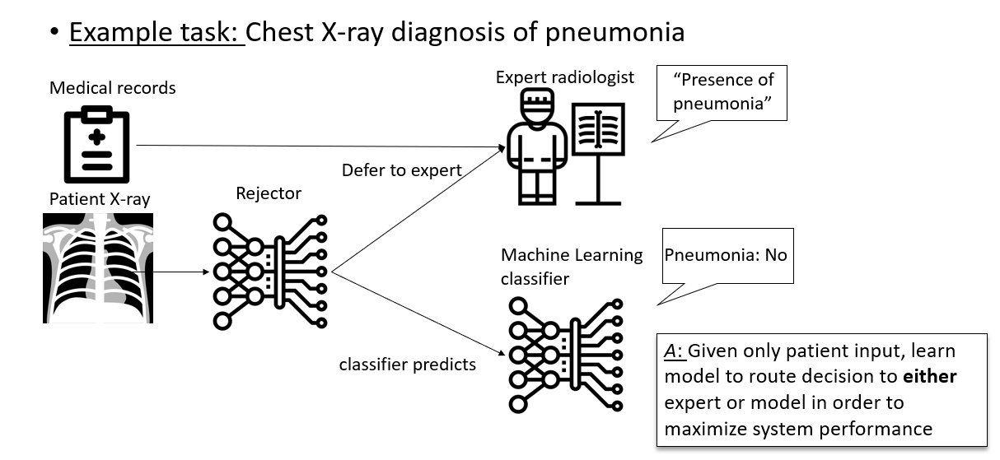
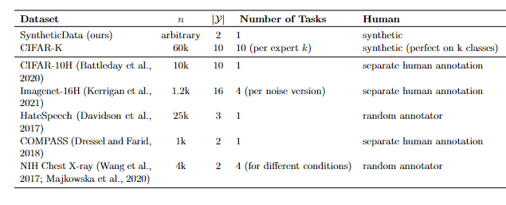

# Human-AI Deferral: Algorithms and Benchmark for Learning to Defer to Humans

Associated code for paper [Who Should Predict? Exact Algorithms For Learning to Defer to Humans](https://arxiv.org/abs/2301.06197)   published in AISTATS 2023 (oral).


# What is it?


AI systems are frequently used in combination with human decision-makers, including in high-stakes settings like healthcare. 
In these scenarios, machine learning predictors should be able to defer to a human expert instead of predicting on difficult or unfamiliar examples.

As a motivating example, suppose we want to build an AI system 
to predict the presence of pneumonia from a patient's chest X-ray, jointly with an  human radiologist. 
The goal in this work is to jointly learn a classifier that can predict pneumonia and a rejector, which decides
on each data point whether the classifier or the
human should predict. 
By learning the classifier jointly with the rejector, the aim is for the classifier to complement the radiologist so that the Human-AI team performance is higher. 

This repository contains multiple methods to learn such a deferral system and evaluate it on numerous datasets.




# Installation

Create a new conda environmnt (Python 3.8.5 with Pytorch 1.7.1) from our environment.yml file:
```bash
conda env create -f environment.yml
```

Finally activate the environment:
```bash
conda activate deferral
```

And clone the repo:
```bash
git clone REPO URL
```

**Installing Gurobi**: If you are an academic, you can obtain a free license for Gurobi by registering at https://www.gurobi.com/academia/academic-program-and-licenses/. Once you have obtained a license, you can install Gurobi by following the instructions at https://www.gurobi.com/documentation/9.5/quickstart_linux/software_installation_guid.html


# Simple Example

Here is a simple working example to train and evaluate our method on the HateSpeech dataset:

```python

import torch
from helpers.metrics import *
from networks.linear_net import *
import torch.optim as optim
from datasetsdefer.hatespeech import *
from methods.realizable_surrogate import *
import os
device = torch.device("cuda:0" if torch.cuda.is_available() else "cpu")
optimizer = optim.Adam
scheduler = None
lr = 1e-2
total_epochs = 50 
# generate data
dataset = HateSpeech("data", True, False, 'random_annotator', device)
model = LinearNet(dataset.d, 4).to(device)
# instatiate method
RS = RealizableSurrogate(1, 300, model, device, True)
RS.fit_hyperparam(
    dataset.data_train_loader,
    dataset.data_val_loader,
    dataset.data_test_loader,
    epochs=total_epochs,
    optimizer=optimizer,
    scheduler=scheduler,
    lr=lr,
    verbose=False,
    test_interval=5,
)
rs_metrics = compute_deferral_metrics(RS.test(dataset.data_test_loader))
```


# Datasets
We provide several datasets that can be easily instantiated with PyTorch data loaders:




For example:
```python
from datasetsdefer.cifar_h import *
dataset = Cifar10h(False, data_dir = data_dir)
train_loader = dataset.data_train_loader
val_loader = dataset.data_val_loader
test_loader = dataset.data_test_loader
```

# Methods
We implement a host of methods from the literature as well as our new methods:

- RealizableSurrogate (this work): our novel surrogate function

- MILP for deferral (this work): only applies to vector data

- CompareConfidence (Ragu et al. 2019): classifier is trained on cross-entropy (CE), rejector compares confidence of classifier to confidence of human which is also learned

- CrossEntropySurrogate (Mozannar and Sontag 2020) or named LCESurrogate

- OvASurrogate (Verma and Nalisnick 2022)

- Diff-Triage (Okati et al. 2021)

- MixOfExps (Madras et al. 2018)

- SelectivePrediction: classifier is trained on cross-entropy (CE), rejector tresholds confidence of classifier


All methods can be used in a similar fashion, they have a `fit`, `test` and `fit_hyperparam` methods, for example:

```python
model = LinearNet(dataset.d,4).to(device)
RS = RealizableSurrogate(alpha = 1, 300, model, device, True)
RS.fit(
    dataset.data_train_loader,
    dataset.data_test_loader,
    dataset.data_test_loader,
    epochs=total_epochs,
    optimizer=optimizer,
    scheduler=scheduler,
    lr=lr,
    verbose=False,
    test_interval=25,
)
model = LinearNet(dataset.d,4).to(device)
LCE = LceSurrogate(alpha = 1, plotting_interval = 300, model = model, device = device)
LCE.fit_hyperparam(
    dataset.data_train_loader,
    dataset.data_val_loader,
    dataset.data_test_loader,
    epochs=total_epochs,
    optimizer=optimizer,
    scheduler=scheduler,
    lr=lr,
    verbose=False,
    test_interval=25,
)
lce_metrics = compute_coverage_v_acc_curve(LCE.test(dataset.data_test_loader))
```

# Repo Organization

This repository is organized as follows:

- baselines: contains implementations of previous methods from literature, each as a seperate class

- datasetsdefer: implementation of the different datasets used, each as a seperate class

- methods: proposed RealizableSurrogate and MILP 

- experiments: replicates main figures from the paper for each dataset

- networks: PyTorch model class definitions for linear, CNN and FFNN models

- helpers: various methods used, including metrics implementation

One can easily implement new surrogate methods by extending [BaseSurrogateMethod](baselines/basemethod.py). 

We also welcome the addition of new datasets (e.g. dynabench and others).

# Citation

```
@article{mozannar2023should,
  title={Who Should Predict? Exact Algorithms For Learning to Defer to Humans},
  author={Mozannar, Hussein and Lang, Hunter and Wei, Dennis and Sattigeri, Prasanna and Das, Subhro and Sontag, David},
  journal={arXiv preprint arXiv:2301.06197},
  year={2023}
}
```

# Acknowledgements

This work is partially funded by the MIT-IBM Watson AI Lab.

